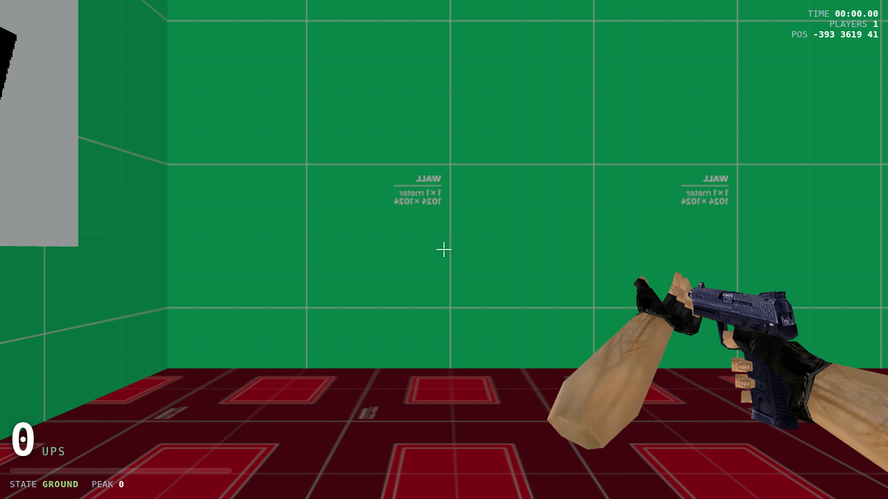

# surf_ski_2 — a browser-native CS 1.6 / GoldSrc surf clone

A faithful Counter-Strike 1.6 **surf** game that runs the real `surf_ski_2.bsp`
in the browser, with GoldSrc (Half-Life engine) player movement reimplemented
exactly from Valve's `pm_shared.c`. No game engine, no build step — just
ES modules and a locally-vendored Three.js.



> **New here?** [`HOWITWORKS.md`](HOWITWORKS.md) is a casual rundown of how it
> all works. [`RELEASE.md`](RELEASE.md) is an honest assessment of what it would
> take to actually release this.

The acceptance bar set by the spec was *"the exact feel of GoldSrc air strafing
and determinism."* That's the core of this project: the movement is a
line-for-line port of the engine's per-tick functions, collision runs against
the BSP's real clip-node hulls, and the whole thing is driven by a fixed
100 Hz timestep so it behaves identically regardless of render frame rate.

---

## Run it

Requires Node (only to serve files — there is no build):

```bash
npm start          # serves on http://localhost:8000
# then open http://localhost:8000 and click to play
```

### Controls

| Input | Action |
| --- | --- |
| **Mouse** | Look. Sync your turn with a strafe key to gain speed. |
| **W A S D** | Move / strafe |
| **Space** | Jump |
| **Shift** | Duck |
| **LMB** | Fire |
| **R** | Reload |
| **1 … 6** | USP · Deagle · M4A1 · AK47 · AWP · M3 |
| **C / X** | Save / load checkpoint (practice) |
| **U** | Restart run |
| **Tab** | Scoreboard (race + K/D) |
| **B / V** | Auto-bunnyhop / noclip |

**Maps:** `surf_ski_2`, `surf_green` (real GoldSrc `.bsp`), and `surf_arena`
(procedurally generated with analytic brush collision). Pick in the menu or via
`?map=`.

**Multiplayer is on by default** — you auto-join the `public` room (serverless
WebRTC via Trystero). Everyone in a room shares the session: you see each other
surf, a live **race scoreboard** (Tab) ranks by top speed, and **PvP counts**
(hitscan vs. other players → damage, kills, kill feed, K/D). Change the room
name to play privately.

**Mobile:** on touch devices an on-screen joystick (left), drag-to-look (right),
and Fire/Jump/Duck/Reload/Weapon buttons appear automatically.

Settings (sensitivity, FOV, volume, render quality) and per-map personal bests
persist in `localStorage`.

**How to surf:** ride the steep ramps. Hold one strafe key (A *or* D) and rotate
the mouse the *same* direction in sync, keeping your aim just off your velocity
vector. Done right, you accelerate well past normal run speed.

---

## How the surf physics actually works

Surf was never designed — it falls out of three existing GoldSrc rules, all of
which are implemented here in [`src/physics.js`](src/physics.js):

1. **`ClipVelocity`** deflects you *along* a surface instead of stopping you.
   On a ramp the surface normal points sideways-and-up; gravity drives your
   velocity into the ramp each tick, `ClipVelocity` strips the into-ramp part
   and leaves velocity running down the ramp face.
2. **`CategorizePosition`** refuses to treat a surface steeper than
   `normal.z < 0.7` (≈45.57°) as ground, so you never enter the grounded state
   on a ramp — no friction, air rules apply, and speed can build.
3. **`AirAccelerate`** lets you add up to a **30**-unit *projected* wishspeed of
   velocity per tick. Because the cap is on the projection onto your aim, not on
   total speed, strafing slightly off-axis keeps the projection under 30 and the
   engine keeps adding a small off-axis vector every tick — rotating and
   lengthening your velocity without bound (until `sv_maxvelocity`).

Per-tick order (from the spec, matching `PM_PlayerMove`):
build wishdir → clamp to `sv_maxspeed` → `CategorizePosition` → jump →
`Friction`+`Accelerate` (ground) or `AirAccelerate` (air) → gravity split →
`FlyMove` (slide + `ClipVelocity` per plane) → `CategorizePosition` →
clamp velocity. Constants live in [`src/constants.js`](src/constants.js)
(`sv_gravity 800`, `sv_friction 4`, `sv_airaccelerate 100`, the 30 wishspeed
cap, the 0.7 ground threshold, etc.).

### Collision is authentic, not approximate

Player collision uses GoldSrc's **clip-node hull tracing**
([`src/hull.js`](src/hull.js) — `PM_RecursiveHullCheck` / `PM_HullPointContents`).
The BSP compiler precomputes, for each player hull (standing = hull 1, ducking =
hull 3), a BSP of planes already expanded by the hull size. Tracing the player's
centre point through these expanded planes is identical to sweeping the player's
box through the world — and it means the surf ramps surf because they really are
angled planes in the trace, exactly as in-engine.

---

## Project layout

```
index.html            click-to-play shell, HUD, crosshair, import map
serve.mjs             zero-dependency static server (correct MIME + ranges)
src/
  constants.js        GoldSrc movement constants (pm_shared.c values)
  vec.js              small vector / AngleVectors helpers
  physics.js          the movement: ClipVelocity, Friction, Accelerate,
                      AirAccelerate, FlyMove, jump, duck, fixed-step runTick
  bsp.js              GoldSrc BSP v30 parser (incl. embedded miptex decode)
  hull.js             clip-node hull tracing (collision)
  render.js           Three.js scene from BSP faces (Z-up → Y-up)
  input.js            pointer-lock mouse look + keyboard
  viewmodel.js        first-person weapon (GLTF) overlay pass
  hud.js              speedometer / timer / state HUD
  main.js             glue: load, fixed-step loop, render interpolation
vendor/               Three.js r160 + GLTFLoader (vendored, no CDN at runtime)
assets/               surf_ski_2.bsp, CC0 textures + models (see Credits)
test/                 deterministic physics tests + headless browser smoke test
tools/                screenshot capture + procedural texture generator
```

---

## Testing

```bash
npm test            # 24 deterministic physics + real-BSP collision checks (Node)
npm run test:browser  # 8 end-to-end checks in headless Chromium (WebGL)
```

The Node suite proves the acceptance criteria headlessly: friction stops the
player on flat ground; a >45.57° ramp never grounds the player; `ClipVelocity`
converts downward velocity into an along-ramp slide; air strafing pushes speed
past the 30 cap to 450+ ups capped only by `sv_maxvelocity`; identical input
sequences produce byte-identical state (determinism); and the real
`surf_ski_2.bsp` parses and collides. The browser suite boots the actual page
and verifies the level renders (WebGL triangles), spawn collision works, and the
shipped physics module surfs in-browser — with zero console errors.

---

## Notes & scope

- Physics run at a **fixed 100 Hz** with an accumulator; rendering interpolates
  between physics states, so feel is identical across machines (this fixes the
  original engine's `fps_max` speed bug).
- `surf_ski_2` references an external WAD for ~55 of its 64 textures, which is
  not redistributable. The 9 textures embedded in the BSP are decoded and shown;
  the rest fall back to shipped CC0 prototype textures, chosen per-surface so the
  level stays readable.
- Brush-entity gameplay (doors, the map's teleport/push triggers) is not
  simulated; collision is against the worldspawn hull, which is where the surf
  ramps live. Falling off respawns you at the spawn point.

---

## Credits

- **Map:** `surf_ski_2.bsp` (GoldSrc / Counter-Strike 1.6 community surf map).
- **Movement model:** Valve `pm_shared.c` and the Quake QW `pmove` lineage.
- **Engine:** [Three.js](https://threejs.org) r160 (MIT), vendored.
- **Prototype textures:** [Kenney — Prototype Textures](https://kenney.nl/assets/prototype-textures) (CC0),
  via the [Calinou/kenney-prototype-textures](https://github.com/Calinou/kenney-prototype-textures) mirror.
- **Weapon models:** [Quaternius](https://quaternius.com) guns (CC0), via
  [poly.pizza](https://poly.pizza).

Project code: MIT. Bundled third-party assets retain their respective licenses
(all CC0 or MIT as noted above).
